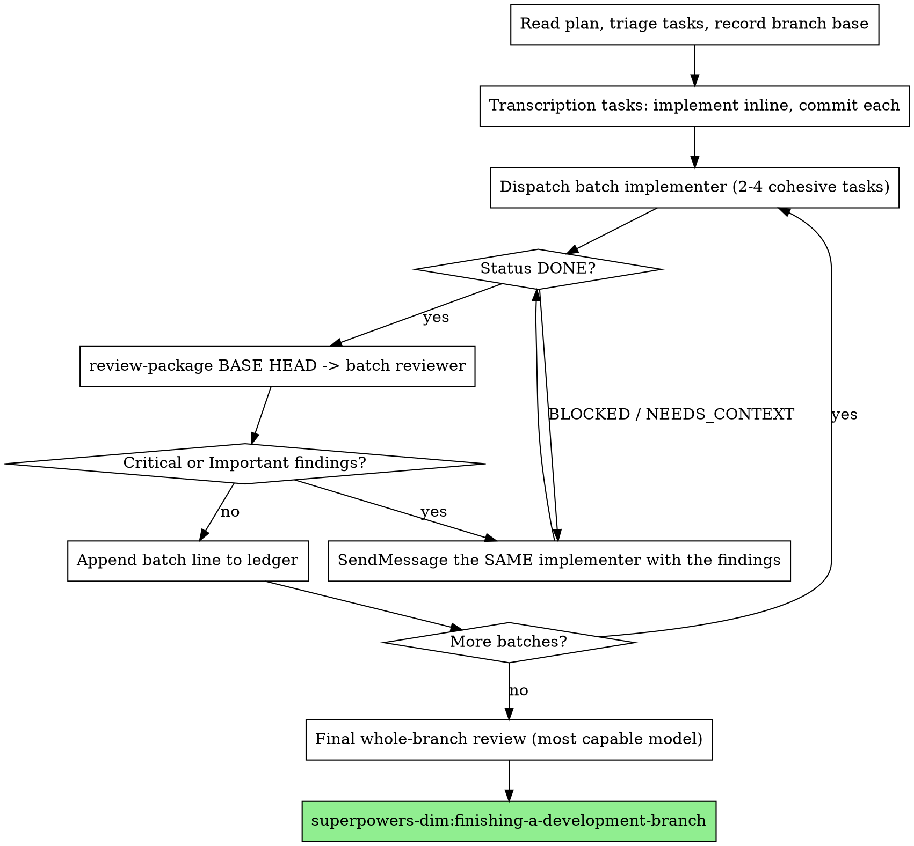

# Batched Execution (budget mode)

Execute a written plan with the same gates as
`superpowers-dim:subagent-driven-development`, but pay for them once per
batch instead of once per task.

**Core principle:** the expensive thing is not the number of dispatches — it
is the number of **context rebuilds**. Every fresh subagent re-reads the
brief, the surrounding code, and the conventions before it writes a line.
This skill removes rebuilds that buy nothing, and keeps the ones that buy
independent judgment.

**Honest accounting:** expect roughly 40–60% of strict SDD's token cost, not
a 3× saving. A batch implementer lives longer and costs more per dispatch;
what shrinks is how many times context is rebuilt from zero.

## When to Use

Use **batched** when all of these hold:

- A written plan already exists (from `superpowers-dim:writing-plans`).
- The user signalled a budget constraint, or the plan is long and mostly
  mechanical.
- No task in the plan is high-risk (see below).

Stay with **strict `subagent-driven-development`** when the change touches
auth, payments, data migration, concurrency, a public API, or anything the
user called risky. Budget mode buys speed with review coverage — do not
spend that currency on work where a missed defect is expensive.

Use **`superpowers-dim:lite`** instead when there is no plan document and the
whole change fits in one head.

## Step 0: Triage the Tasks

Before dispatching anything, read the plan once and sort every task into one
of three buckets. This step is where most of the saving comes from — do not
skip it.

| Bucket | Test | Who does it |
|---|---|---|
| **Transcription** | the plan already contains the code to write; the work is transcription plus running tests | **you, inline** — a subagent would pay a full context rebuild to type text you already hold |
| **Batch** | ordinary implementation; the task shares context with its neighbours | batch implementer, several tasks per dispatch |
| **Solo-risk** | touches a schema, a public interface, secrets, real data, or the network; or later tasks depend on getting this exactly right | its own implementer + its own reviewer, as in strict SDD |

Report the triage in one short table before you start, so the user can move
a task between buckets. Then execute it without asking again.

**Do not batch by count — batch by cohesion.** Strict SDD wants independent
tasks precisely because a fresh context helps there. A batch is only cheaper
when task N+1 *reuses* what the implementer learned in task N: same module,
same schema, same file set. Two unrelated tasks in one dispatch cost the
same as two dispatches and lose the fresh-context benefit.

Batch size: 2–4 tasks. Beyond that the implementer's own context degrades
and you trade tokens for defects.

## The Loop



Everything not restated here follows
`superpowers-dim:subagent-driven-development`: the pre-flight plan scan, the
implementer status contract (DONE / DONE_WITH_CONCERNS / NEEDS_CONTEXT /
BLOCKED), file handoffs, and the never-on-main rule.

## Fix Loop: Resume, Don't Re-dispatch

Strict SDD dispatches a **new** fix subagent per review wave. In budget mode
that is the single most wasteful move available: the fixer rebuilds the exact
context the implementer already holds.

- **Fixes go back to the same implementer** via `SendMessage` with its agent
  id — the findings list plus the diff path, nothing else. It still owes the
  implementer contract: re-run the tests covering the change and append the
  results to its report file.
- **Fresh eyes are for the reviewer, not the fixer.** A fixer benefits from
  remembering why the code is shaped that way.
- **Re-review only on Critical.** For Important findings, verify the fix
  report yourself against the finding list. For Minor, record them in the
  ledger and hand the list to the final whole-branch review — the same
  roll-up strict SDD uses.
- If the implementer's session is gone (compaction, a new session), dispatch
  a fix subagent as strict SDD does. One rebuild is still cheaper than
  reconstructing the batch.

## Review Gating

| What | Gets a review subagent? |
|---|---|
| Transcription tasks you implemented inline | no — they ride into the batch reviewer's diff, and into the final review |
| Batch | one reviewer per batch, over the batch's whole diff |
| Solo-risk task | its own reviewer, immediately |
| Whole branch | always — this is the one review budget mode never cuts |

The batch reviewer returns **one verdict pair per task in the batch**, not
one for the batch as a whole. A single "looks fine" over four tasks is how a
missing requirement survives.

Your own reading of a diff is triage, not review — it decides whether a
reviewer is warranted, and never substitutes for one. You wrote or dispatched
the code; you are not fresh eyes on it.

## Model Ladder

Always name the model explicitly — an omitted model inherits the session's,
usually the most expensive one, which defeats the entire skill.

| Role | Tier | Why |
|---|---|---|
| Transcription tasks | none (you, inline) | zero rebuild |
| Batch implementer, mechanical batch | cheap | plan carries the decisions |
| Batch implementer, integration batch | standard | multi-file judgment |
| Solo-risk implementer | standard | mistakes here are expensive |
| Batch reviewer | standard | a cheap reviewer misses what it was hired to find |
| Final whole-branch review | most capable | last gate before merge |

Turn count beats token price: a cheap model that needs three passes over a
multi-step batch costs more than a standard model that needs one. The cheap
tier is for batches whose plan text already contains the code.

## Risk-Based TDD

Strict TDD is not free — it is roughly a doubled turn count on the
implementer. Budget mode spends it where it catches things.

| Task shape | Discipline |
|---|---|
| Business logic, data transformation, parsers, migrations, error and edge-case handling | full TDD: failing test → watch it fail → minimal code → green. Non-negotiable. |
| Schemas, config, wiring, static files, mechanical transcription | schema/lint validation plus one smoke or integration test **per batch** |

This is a real reduction in coverage, not a free optimization. Say so in the
final report: name which tasks got full TDD and which rode on batch-level
smoke tests, so the user can decide whether to backfill.

If a "mechanical" task turns out to contain a branch, a conversion, or an
error path — it was misfiled. Move it to full TDD and say so.

## Durable Progress

Same ledger as strict SDD —
`$(git rev-parse --show-toplevel)/.superpowers/sdd/progress.md`, checked at
start and appended after every clean review. Batched lines name the batch:

```
Batch 2 (Tasks 3-5): complete (commits <base7>..<head7>, review clean)
Minor deferred: <finding> — for final review
```

Deferred Minor findings live in the ledger, not in your context. The final
whole-branch review dispatch points at that list.

In a beads project, the plan's tasks are beads: mark each `in_progress` when
its batch is dispatched and close it when its verdict comes back clean. The
ledger and the beads are both recovery maps — after compaction, trust them
over your recollection.

## Tooling (reuse, do not rewrite)

All of it lives in `../subagent-driven-development/scripts/`:

- `task-brief PLAN_FILE N [OUTFILE]` — one call per task in the batch;
  hand the implementer the list of brief paths. Exact values (numbers, magic
  strings, signatures) appear only in the briefs, never pasted into the
  dispatch.
- `review-package BASE HEAD` — BASE is the commit recorded before the batch
  was dispatched, never `HEAD~1`: a batch is many commits by construction.
- `sdd-workspace` — where briefs, reports, and packages go.

Prompt templates: [batch-implementer-prompt.md](batch-implementer-prompt.md)
and [batch-reviewer-prompt.md](batch-reviewer-prompt.md) — both are deltas
over the strict templates, so upstream improvements to those still apply.

## What This Deliberately Drops

| Strict SDD | batched |
|---|---|
| fresh implementer per task | one implementer per cohesive batch of 2–4 |
| implementer for every task | transcription tasks done inline by the controller |
| reviewer after every task | reviewer per batch; per-task only for solo-risk |
| new fix subagent per review wave | same implementer resumed via `SendMessage` |
| re-review after every fix | re-review on Critical only |
| full TDD everywhere | full TDD on logic; smoke + validation on mechanical work |
| final whole-branch review | unchanged — always, on the most capable model |

## Red Flags

- **"I'll batch all 8 tasks into one dispatch."** That is not budget mode,
  that is an unreviewed monolith. Cap at 4.
- **"The batch reviewer said it's fine."** Not a verdict — demand the
  per-task pairs.
- **"This task is high-risk but I'll batch it anyway to save a call."**
  Solo-risk is the bucket that exists to stop exactly this.
- **"I read the diff myself, no reviewer needed."** You are not fresh eyes.
- **"Tests after, it's mechanical."** Check the task shape against the TDD
  table before deciding it is mechanical.
- **"I'll skip the final review, everything passed."** The one review budget
  mode never cuts.
- **Starting on main/master** without explicit consent — same rule as strict
  SDD.

## Integration

- **`superpowers-dim:writing-plans`** — produces the plan this skill executes
- **`superpowers-dim:subagent-driven-development`** — the strict form; every
  rule not overridden here comes from it
- **`superpowers-dim:requesting-code-review`** — the final whole-branch review
- **`superpowers-dim:finishing-a-development-branch`** — integration after the
  last batch
- **`superpowers-dim:lite`** — the smaller sibling: no plan, no subagents
